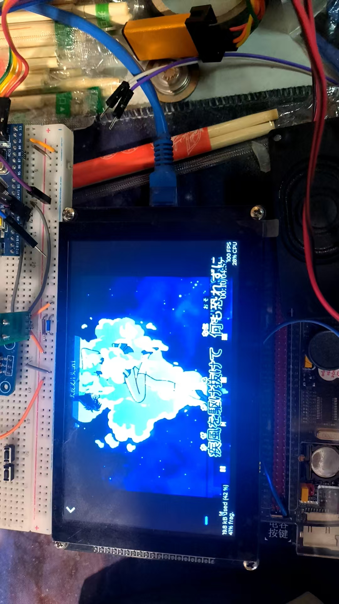
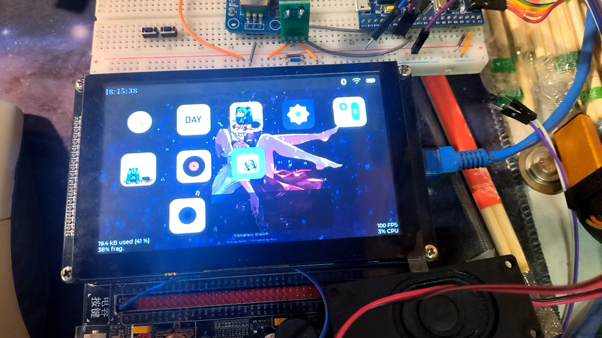
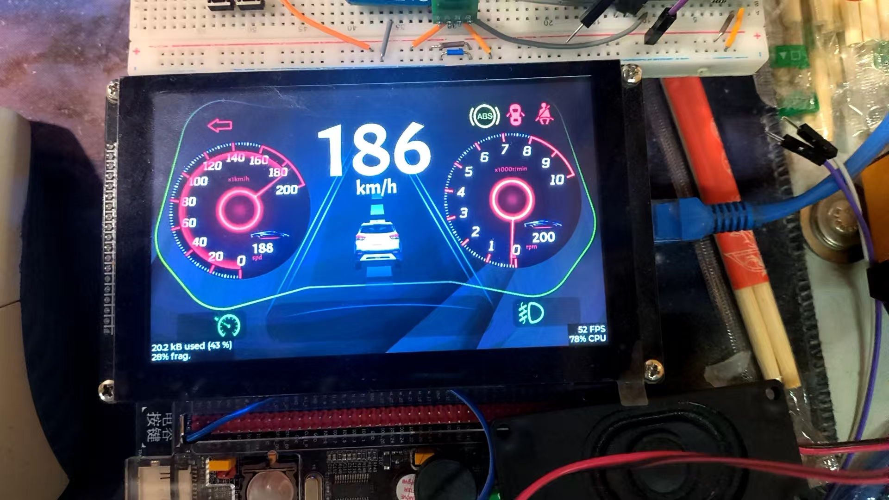
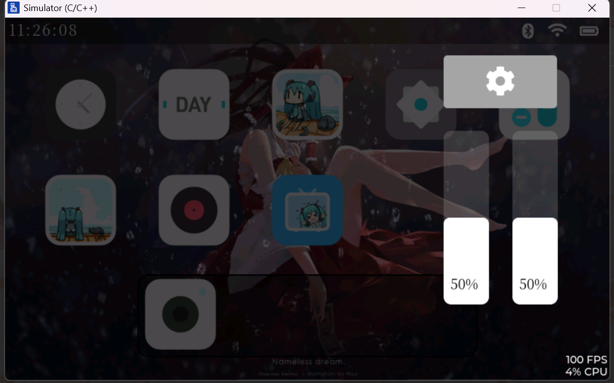
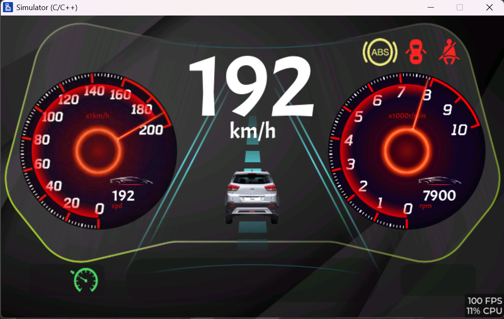
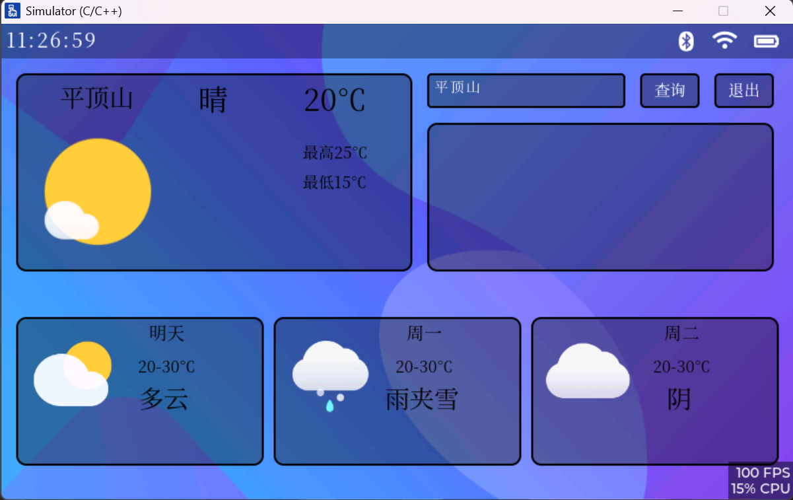
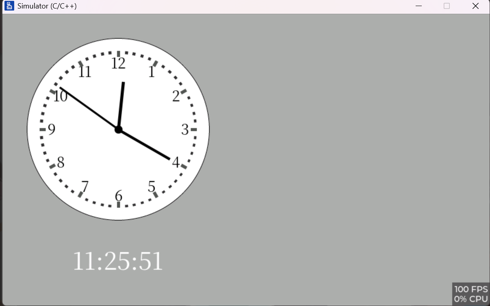
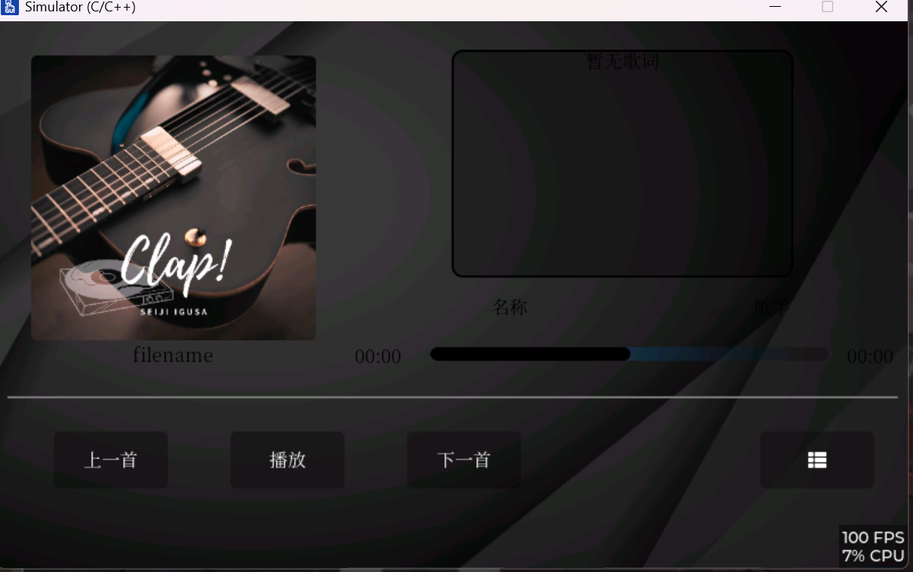
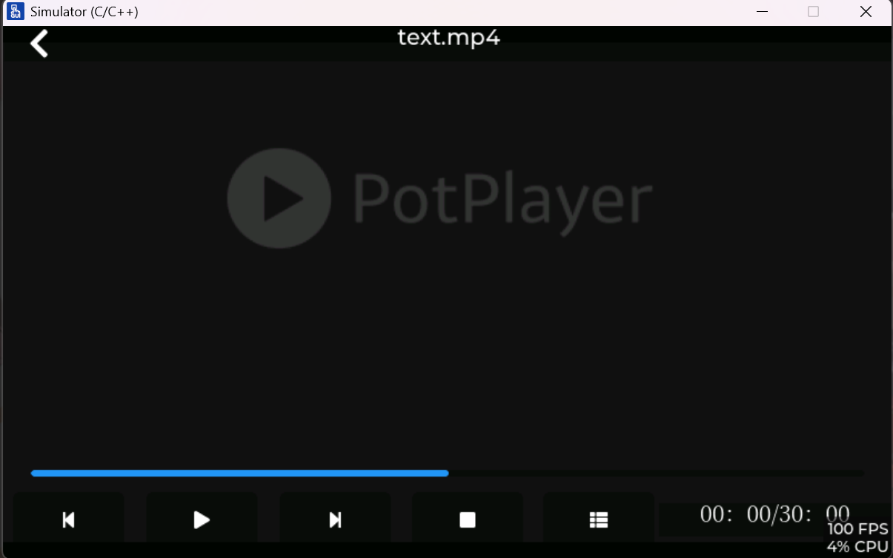

# 在IMX6ULL上的 Linux应用开发

---

## 硬件实物图：
基于野火的imx6ull开发板
- 视频播放：

- 桌面：

- 仪表盘：

## ui设计基于nxp的gui guider设计

---

## 软件环境

- ubuntu20.20：交叉编译工具链 lvgl的移植 相关第三方库的交叉编译(本项目不提供第三方库，如有需要自行编译)
- imx6ull开发板：烧录系统，部署应用，调试应用
- gui guider：ui设计工具，生成c代码

## 应用程序设计相关

- ffmpeg相关的应用(音视频播放)设计基于vibe coding，仅供参考(视频未实现音视频同步，主要imx6ull算力太弱，效果不好，后续可能从线程优先级的角度设计同步)
- 摄像头基于v4l2框架读取数据，显示到lvgl的img上(注意 野火所提供的摄像头驱动程序仅支持yuyv，本人结合正点原子的驱动程序，扩展了野火ov5640的驱动格式支持)
- can通讯使用socket can(已完成，stm32旋转编码器和仪表盘的显示)
- 天气应用程序使用libcurl获取天气数据(后续添加，设计中)
- 时钟显示(后续设计时钟调节的接口)
- 后续可能添加更多界面设计和功能

## 相关链接
- [ui设计](https://github.com/co-cold/imx6ull_demo)